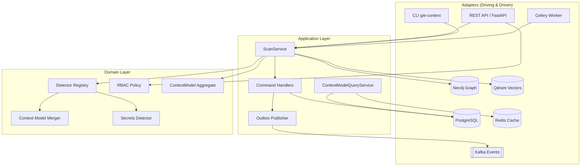
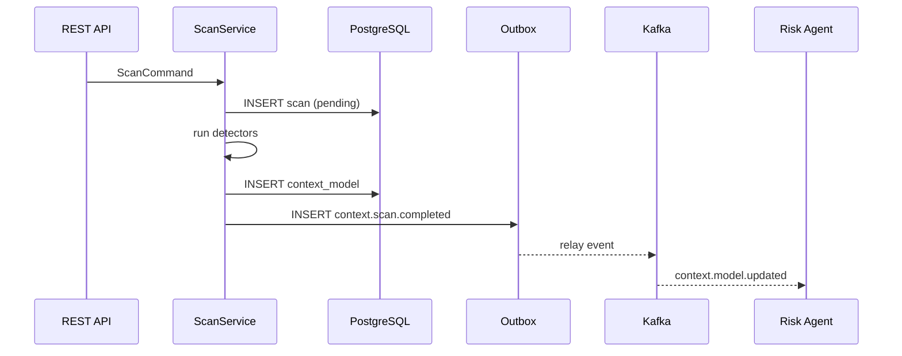

# GIE Context Intelligence — Architecture

The Context Intelligence Agent follows **Clean Architecture** with **Hexagonal (Ports & Adapters)**, **Domain-Driven Design**, **CQRS**, and **Event-Driven** integration.

## Layer Overview



## Hexagonal Boundaries

| Port | Adapter | Direction |
|------|---------|-----------|
| `ScanPort` | REST, CLI, Celery | Driving |
| `ContextModelRepository` | PostgreSQL | Driven |
| `GraphRepository` | Neo4j | Driven |
| `VectorRepository` | Qdrant | Driven |
| `EventPublisher` | Kafka outbox | Driven |
| `SecretScanner` | filesystem detector | Domain service |

## DDD Bounded Context

**Context Intelligence** is a bounded context responsible for *understanding* AI applications. It publishes `ContextModelUpdated` events that other GIE contexts subscribe to:

- **Risk Assessment** — consumes secret findings and autonomous capabilities
- **Policy Engine** — consumes frameworks and data stores
- **Compliance** — consumes provenance and evidence

The `ContextModel` is the aggregate root. `Scan` is a process manager coordinating detector execution.

## CQRS Split

| Side | Responsibility | Storage |
|------|----------------|---------|
| **Commands** | Create scan, persist model, emit events | PostgreSQL write model + outbox |
| **Queries** | Get scan status, fetch context model | PostgreSQL + Redis read cache |

Write path:

```
POST /v1/scans → ScanCommand → ScanService → Detectors → Merge → Persist → Outbox
```

Read path:

```
GET /v1/context-models/{id} → QueryHandler → Redis? → PostgreSQL → Envelope
```

## Event Flow



## Detector Pipeline

Detectors implement a common protocol and run concurrently where safe. Results merge with deduplication by `(name, version)` for items and `(kind, location, fingerprint)` for secrets.

## Cross-Cutting Concerns

- **Observability:** OpenTelemetry traces, Prometheus metrics, structlog JSON
- **Security:** JWT/API key auth, RBAC, mTLS at ingress (see SECURITY.md)
- **Resilience:** Per-detector failure isolation, Celery retries, idempotency keys

## Technology Mapping

See [TECH_STACK.md](TECH_STACK.md) and [FOLDER_STRUCTURE.md](FOLDER_STRUCTURE.md).
