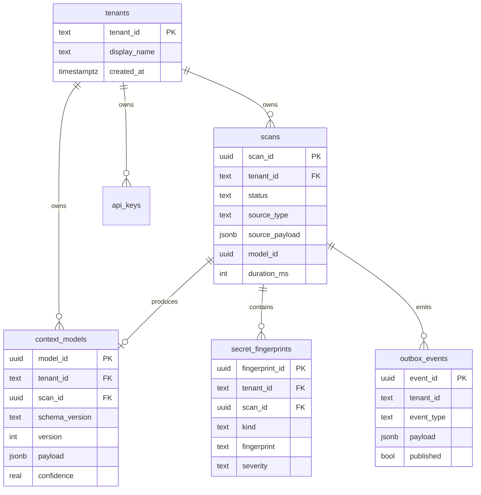

# Database Design — Context Intelligence Agent

## Store Overview

| Store | Role | Data |
|-------|------|------|
| **PostgreSQL** | System of record (CQRS write + read) | Scans, context models, outbox, API keys |
| **Redis** | Cache + Celery broker | Model cache, scan status, task queue |
| **Neo4j** | Graph queries | Component relationships from ContextModel.graph |
| **Qdrant** | Vector search | Prompt/tool embeddings for similarity |
| **Kafka** | Event bus | Scan lifecycle, model updated |

## PostgreSQL Schema

Canonical DDL: `agents/context-intelligence/infrastructure/persistence/schema.sql`

### Core Tables



### Indexing Strategy

- `scans(tenant_id, status)` — dashboard queries
- `scans(tenant_id, idempotency_key)` UNIQUE — deduplication
- `context_models(tenant_id, created_at DESC)` — list models
- Partial index on `outbox_events WHERE published = false` — relay worker

### JSONB Payload

Full `ContextModel` serialized to `context_models.payload`. Extracted columns (`confidence`, `schema_version`) support filtering without parsing JSON.

## Redis

| Key pattern | TTL | Purpose |
|-------------|-----|---------|
| `ctx:model:{tenant}:{model_id}` | 15m | GET cache |
| `ctx:scan:{tenant}:{scan_id}` | 1h | Status cache |
| `celery` queues | — | Task broker |

Eviction policy: `allkeys-lru` with memory cap per environment.

## Neo4j Graph

Nodes mirror `GraphSection`:

```
(:Project {id, name})
(:Framework {name, version})
(:MCPServer {name})
(:SecretFinding {fingerprint, kind})
```

Relationships:

```
(:Project)-[:USES_FRAMEWORK]->(:Framework)
(:Project)-[:EXPOSES_MCP]->(:MCPServer)
(:Project)-[:HAS_SECRET]->(:SecretFinding)
```

Populated asynchronously after scan completion via worker.

## Qdrant

Collection: `gie_context_prompts`

| Field | Type | Purpose |
|-------|------|---------|
| `id` | UUID | Point ID |
| `vector` | float[384] | Prompt embedding |
| `tenant_id` | keyword | Filter |
| `scan_id` | keyword | Provenance |
| `path` | text | Source file |

Used for cross-project prompt similarity, not primary storage.

## Event Outbox Pattern

Transactional outbox ensures at-least-once delivery:

1. `BEGIN` transaction
2. INSERT `context_models`
3. INSERT `outbox_events` (`context.scan.completed`)
4. `COMMIT`
5. Relay worker polls unpublished events → Kafka → mark `published=true`

Event payloads reference `model_id` and summary stats — no raw secrets.

## Migrations

- SQL schema file for greenfield installs
- Alembic migrations for incremental changes (recommended for production)

```bash
cd agents/context-intelligence
alembic upgrade head
```

## Backup & Retention

| Store | Backup | Retention |
|-------|--------|-----------|
| PostgreSQL | RDS automated snapshots | 14 days (prod) |
| Redis | AOF + snapshot | Ephemeral cache OK |
| Neo4j | Volume snapshots | 7 days |
| Qdrant | Collection export | 7 days |
| Kafka | Cluster retention | 7 days |

## Multi-Tenancy

All tables include `tenant_id`. Application layer enforces tenant scope on every query. Row-level security (RLS) recommended for defense in depth:

```sql
ALTER TABLE context_models ENABLE ROW LEVEL SECURITY;
CREATE POLICY tenant_isolation ON context_models
  USING (tenant_id = current_setting('app.tenant_id'));
```
