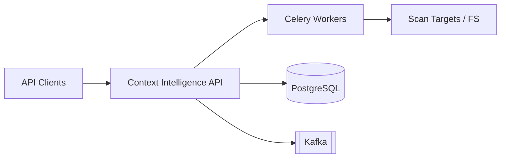

# Threat Model — Context Intelligence Agent

Methodology: **STRIDE** per component. Scope: REST API, workers, data stores, scan pipeline.

## System Boundaries

## Assets

| Asset | Sensitivity | Impact if compromised |
|-------|-------------|----------------------|
| Context Models | Confidential | Exposure of AI architecture, secret locations |
| Secret fingerprints | High | Correlation attacks if pepper leaked |
| API keys / JWT secrets | Critical | Unauthorized scans, data exfiltration |
| Scan source paths | Internal | Path traversal to sensitive files |
| Tenant isolation data | Critical | Cross-tenant data leak |

## STRIDE Analysis

### REST API

| Threat | Category | Mitigation |
|--------|----------|------------|
| Unauthenticated scan requests | Spoofing | Bearer JWT/API key required (`require_auth`) |
| Token replay | Spoofing | Short-lived JWTs, key rotation |
| Privilege escalation | Elevation | RBAC roles (viewer/scanner/admin) |
| Mass scan DoS | Denial of Service | Rate limits at ingress, HPA, scan file budgets |
| Response tampering | Tampering | TLS/mTLS at ingress |
| Scan path traversal | Tampering | Resolve paths, reject symlinks outside root |
| Context model disclosure | Information Disclosure | Tenant-scoped queries, no raw secrets in responses |
| Missing audit trail | Repudiation | Structured logs with trace_id, outbox events |

### Scan Pipeline / Detectors

| Threat | Category | Mitigation |
|--------|----------|------------|
| Malicious project files | Elevation | File size limits, sandboxed workers, no code execution |
| Secret exfiltration via logs | Information Disclosure | Fingerprint-only storage, log redaction |
| Detector crash cascade | Denial of Service | Per-detector failure isolation |
| Supply chain in dependencies | Tampering | Locked deps, CI image scanning |

### PostgreSQL

| Threat | Category | Mitigation |
|--------|----------|------------|
| SQL injection | Tampering | Parameterized queries (SQLAlchemy) |
| Cross-tenant reads | Information Disclosure | Row-level tenant_id filtering |
| Backup exposure | Information Disclosure | Encrypted RDS, IAM-scoped access |

### Redis / Celery

| Threat | Category | Mitigation |
|--------|----------|------------|
| Queue poisoning | Tampering | TLS to Redis, auth token |
| Task hijacking | Spoofing | Worker-only network policies |

### Kafka Events

| Threat | Category | Mitigation |
|--------|----------|------------|
| Event injection | Spoofing | mTLS + ACLs on brokers |
| PII in events | Information Disclosure | Event schema excludes raw secrets |

## Trust Boundaries

1. **Internet → Ingress:** Untrusted; requires auth + TLS
2. **Ingress → API pods:** Semi-trusted; mTLS optional via service mesh
3. **API → Data stores:** Trusted network segment; credentials via Secrets Manager
4. **Worker → Scan target:** Untrusted input; read-only, bounded traversal

## Residual Risks

| Risk | Severity | Acceptance / Follow-up |
|------|----------|------------------------|
| Zero-day in parser dependencies | Medium | Dependabot, regular base image updates |
| Fingerprint collision (theoretical) | Low | SHA-256 with pepper |
| Insider with admin role | High | Audit logs, break-glass procedures |

## Security Testing

- `tests/security/test_auth_required.py` — unauthenticated requests rejected
- Periodic penetration testing on staging
- Container image scanning in CI (recommended addition)

See [SECURITY.md](SECURITY.md) for controls implementation.
