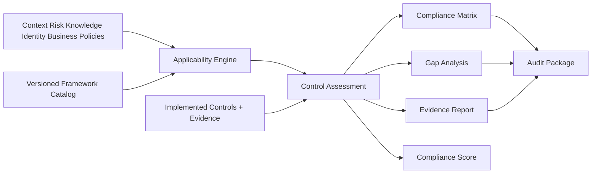

# Compliance Intelligence Architecture

```mermaid
flowchart LR
  Bundle[Context Risk Knowledge Identity Business Policies] --> Applicability[Applicability Engine]
  Catalog[Versioned Framework Catalog] --> Applicability
  Applicability --> Assess[Control Assessment]
  Implemented[Implemented Controls + Evidence] --> Assess
  Assess --> Matrix[Compliance Matrix]
  Assess --> Gaps[Gap Analysis]
  Assess --> Evidence[Evidence Report]
  Assess --> Score[Compliance Score]
  Matrix --> Audit[Audit Package]
  Gaps --> Audit
  Evidence --> Audit
```

Hexagonal: REST/MCP/CLI adapters → CQRS handlers (analyze/validate) → domain engine + catalog → in-memory/Postgres repositories + event publisher.
