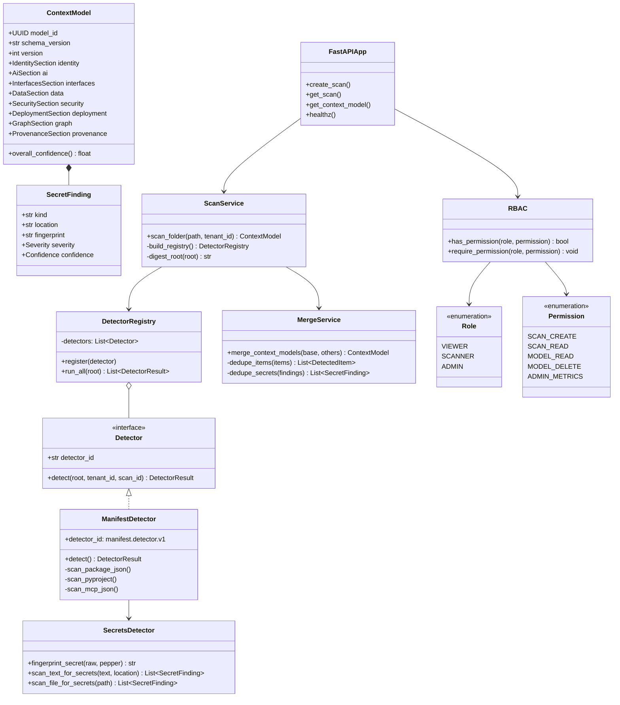

# Context Intelligence — Class Diagram

Core domain and application types.

## Package Layout

| Package | Classes |
|---------|---------|
| `domain/` | Detectors, merge, secrets, rbac |
| `application/` | ScanService, query handlers |
| `adapters/rest/` | FastAPIApp, auth middleware |
| `adapters/persistence/` | Repository implementations |
| `infrastructure/` | Celery, Kafka outbox relay |
