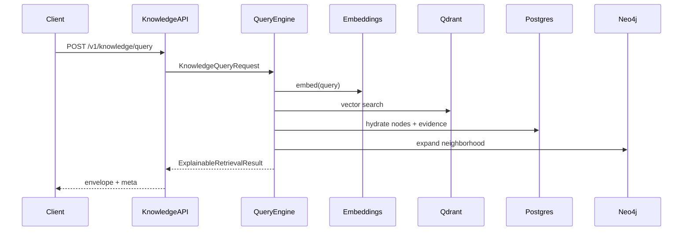

# Sequence — Knowledge Query

```mermaid
sequenceDiagram
  participant Client
  participant API as KnowledgeAPI
  participant QE as QueryEngine
  participant Emb as Embeddings
  participant V as Qdrant
  participant PG as Postgres
  participant G as Neo4j
  Client->>API: POST /v1/knowledge/query
  API->>QE: KnowledgeQueryRequest
  QE->>Emb: embed(query)
  QE->>V: vector search
  QE->>PG: hydrate nodes + evidence
  QE->>G: expand neighborhood
  QE-->>API: ExplainableRetrievalResult
  API-->>Client: envelope + meta
```
