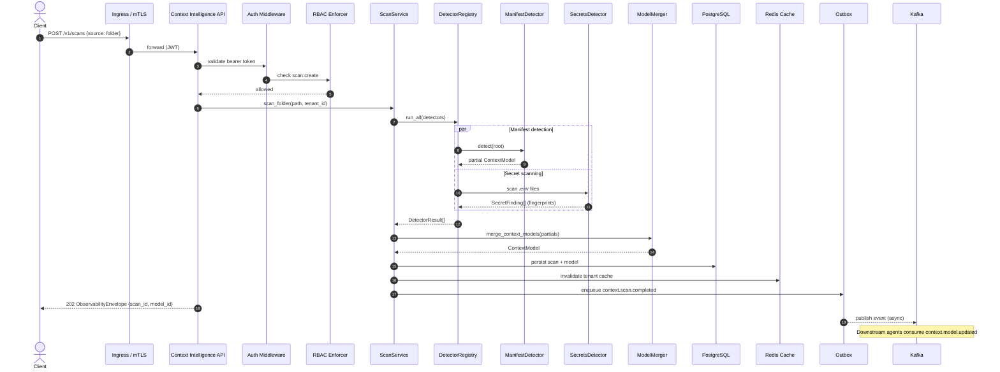

# Scan Sequence Diagram

End-to-end flow for a folder scan via REST API.

## Failure Isolation

If `ManifestDetector` throws, `DetectorRegistry` captures the error and continues. The merged model includes provenance from successful detectors only; failed detector IDs appear in logs with `error` field.

## Idempotency

Clients may supply `idempotency_key`. Duplicate keys within a tenant return the existing scan record without re-running detectors.
