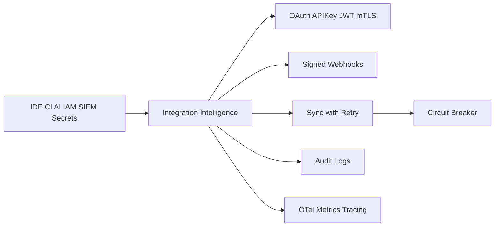

# Integration Architecture

```mermaid
flowchart LR
  Surfaces[IDE CI AI IAM SIEM Secrets] --> Agent[Integration Intelligence]
  Agent --> Auth[OAuth APIKey JWT mTLS]
  Agent --> Webhooks[Signed Webhooks]
  Agent --> Sync[Sync with Retry]
  Sync --> CB[Circuit Breaker]
  Agent --> Audit[Audit Logs]
  Agent --> Obs[OTel Metrics Tracing]
```
