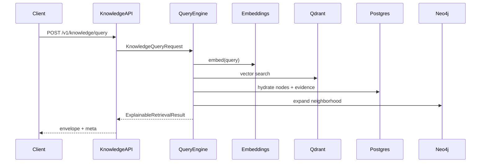
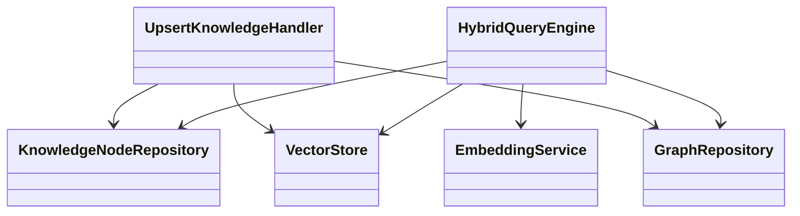

# Knowledge Intelligence Architecture

## Hexagonal / Clean Architecture

```
adapters (REST, MCP, CLI, Kafka, Webhooks)
        ↓
application (CQRS: query engine, upsert, reindex, diff)
        ↓
domain (ports, entities, RBAC, reasoning)
        ↓
infrastructure (Postgres, Neo4j, Qdrant, Redis, Kafka, HashEmbedder)
```

## Data plane

| Store | Role |
|-------|------|
| PostgreSQL | Source of truth for nodes, edges, versions, evidence, outbox, audit |
| Neo4j | Relationship graph projection & path queries |
| Qdrant | Embedding index (`knowledge_embeddings`) |
| Redis | Query cache, rate limits, Celery broker |
| Kafka | `gie.knowledge.events` / `gie.knowledge.commands` |

## Query pipeline

1. Embed query (deterministic hash embedder locally; swappable vendor model)
2. Semantic search in Qdrant
3. Keyword search over node text
4. Hybrid merge / rerank
5. Optional 1-hop Neo4j expansion + shortest paths
6. Attach evidence + build reasoning path
7. Cache result

## Sequence — explainable query



## Class diagram (core)



## Extensibility

- Swap `HashEmbeddingService` for OpenAI/Azure/Bedrock via `EmbeddingService` port
- Register new seed corpora under `data/seed/`
- Add detectors/mappings as nodes with `MAPS_TO` / `MITIGATES` edges
