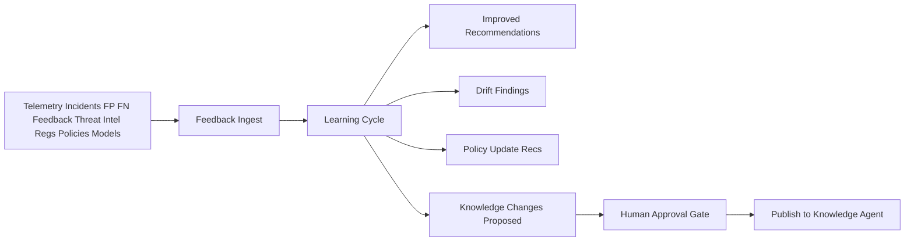

# Learning Architecture

```mermaid
flowchart LR
  Signals[Telemetry Incidents FP FN Feedback Threat Intel Regs Policies Models] --> Ingest[Feedback Ingest]
  Ingest --> Cycle[Learning Cycle]
  Cycle --> Improve[Improved Recommendations]
  Cycle --> Drift[Drift Findings]
  Cycle --> Updates[Policy Update Recs]
  Cycle --> Knowledge[Knowledge Changes Proposed]
  Knowledge --> Approval[Human Approval Gate]
  Approval --> Publish[Publish to Knowledge Agent]
```
