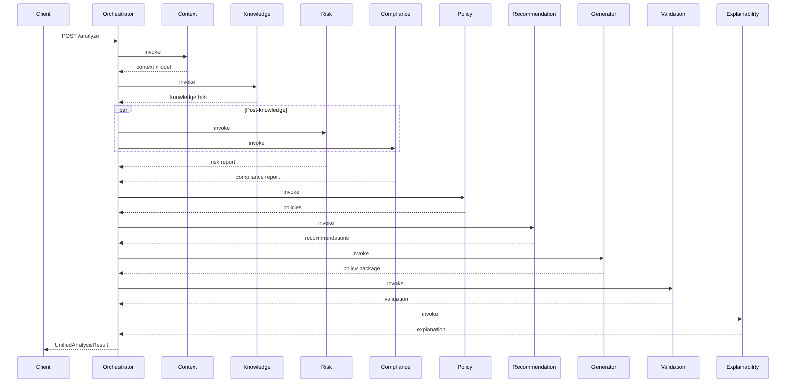
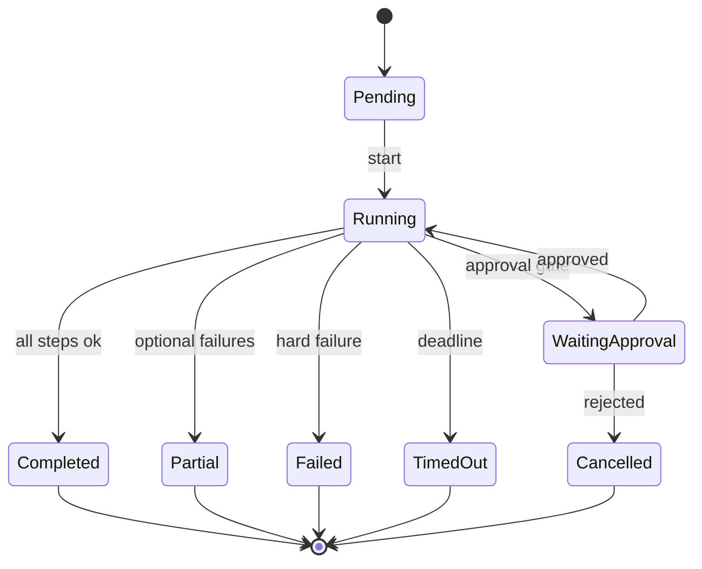
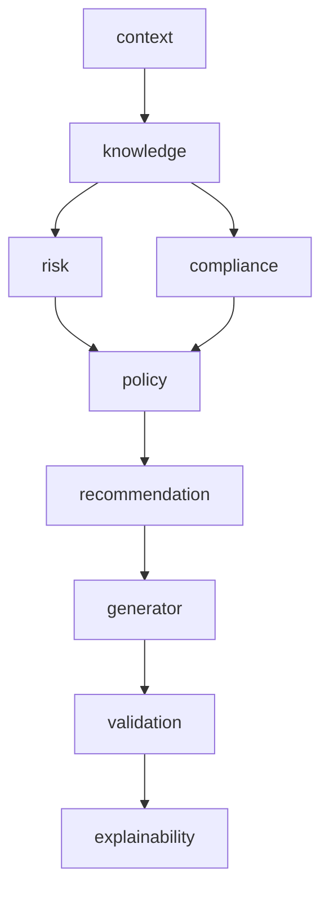

# Orchestrator Architecture

## Sequence — unified analyze

## State machine

## Execution graph (default parallel)

## Retry strategy

| Layer | Strategy |
|-------|----------|
| Step | Exponential backoff (`base * 2^attempt`), default 2 retries |
| Retryable errors | timeouts, unavailable, 5xx |
| Circuit (downstream) | Integration agent circuit breakers for external systems |
| Global | Optional `timeout_ms` on analyze request |

## Performance optimizations (enterprise)

1. **Parallel waves** — Risk ∥ Compliance after Knowledge
2. **Step result caching** — SHA-256 keyed by tenant + step + input fingerprint
3. **Async mode** — return quickly; poll `/execution/{id}`
4. **Batch concurrency limit** — protect downstream agents
5. **Version routing** — pin agent versions per request
6. **Distributed tracing** — span per step; query `/trace/{id}`
7. **Event publishing** — started / step / completed / approval for bus consumers
8. **Simulate mode** — local/CI without requiring all agents up
