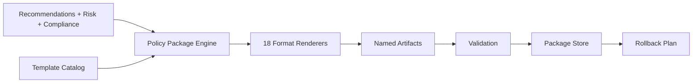

# Policy Generator Architecture

```mermaid
flowchart LR
  Recs[Recommendations + Risk + Compliance] --> Engine[Policy Package Engine]
  Templates[Template Catalog] --> Engine
  Engine --> Render[18 Format Renderers]
  Render --> Artifacts[Named Artifacts]
  Artifacts --> Validate[Validation]
  Validate --> Persist[Package Store]
  Persist --> Rollback[Rollback Plan]
```

Hexagonal: REST/MCP/CLI → generate/validate handlers → domain renderers + templates → memory/Postgres.
