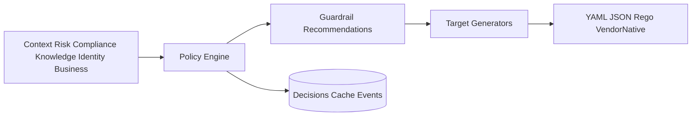

# Policy Intelligence Architecture

Hexagonal layers: adapters → application (generate/explain) → domain (catalog, engine, generators) → infrastructure.

Each recommendation includes why/priority/confidence/impact/effort plus knowledge/risk/compliance refs.
