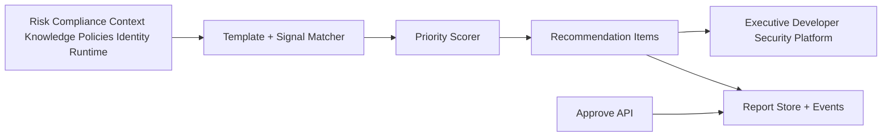

# Recommendation Intelligence Architecture

```mermaid
flowchart LR
  Inputs[Risk Compliance Context Knowledge Policies Identity Runtime] --> Match[Template + Signal Matcher]
  Match --> Score[Priority Scorer]
  Score --> Items[Recommendation Items]
  Items --> Audiences[Executive Developer Security Platform]
  Items --> Persist[Report Store + Events]
  Approve[Approve API] --> Persist
```

Hexagonal: REST/MCP/CLI → CQRS (generate/approve) → domain engine → memory/Postgres + events.
