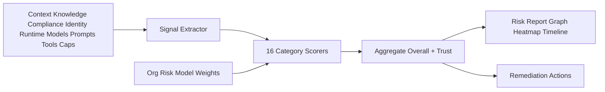

# Risk Intelligence Architecture

```mermaid
flowchart LR
  Inputs[Context Knowledge Compliance Identity Runtime Models Prompts Tools Caps] --> Signals[Signal Extractor]
  Signals --> Scorers[16 Category Scorers]
  Org[Org Risk Model Weights] --> Scorers
  Scorers --> Agg[Aggregate Overall + Trust]
  Agg --> Report[Risk Report Graph Heatmap Timeline]
  Agg --> Remediation[Remediation Actions]
```

Hexagonal: adapters → application (calculate/recalculate) → domain (signals, scorers, mappings, engine) → infrastructure.
