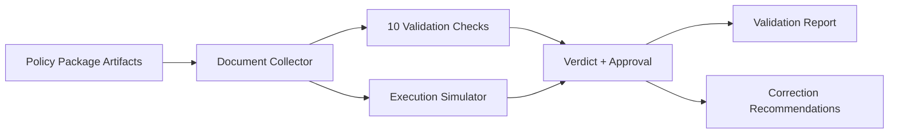

# Validation Architecture

```mermaid
flowchart LR
  Policies[Policy Package Artifacts] --> Collect[Document Collector]
  Collect --> Checks[10 Validation Checks]
  Collect --> Sim[Execution Simulator]
  Checks --> Aggregate[Verdict + Approval]
  Sim --> Aggregate
  Aggregate --> Report[Validation Report]
  Aggregate --> Corrections[Correction Recommendations]
```
